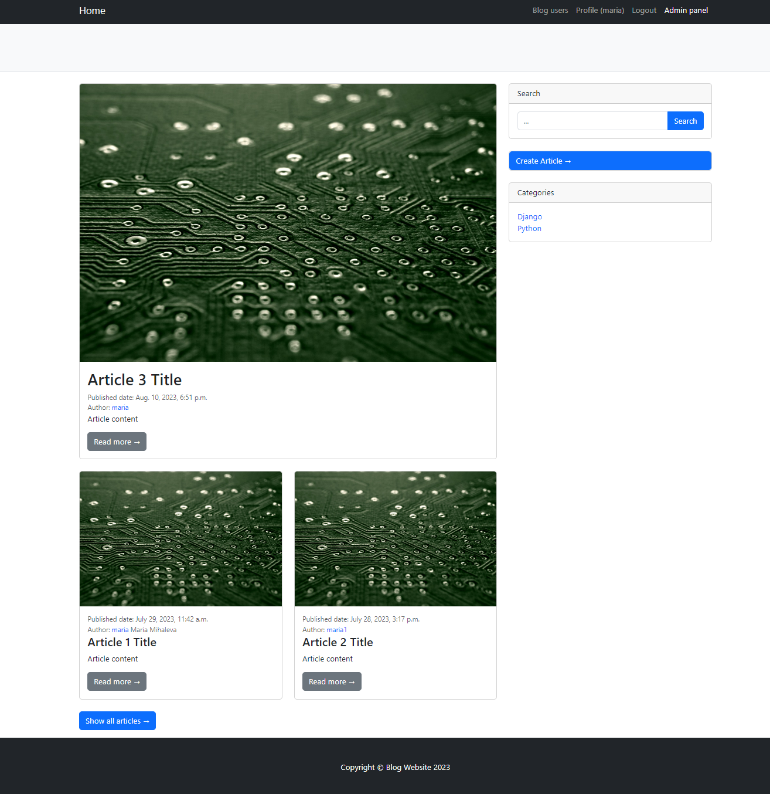
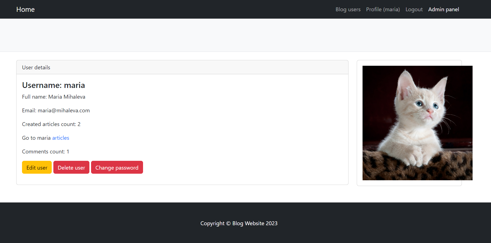
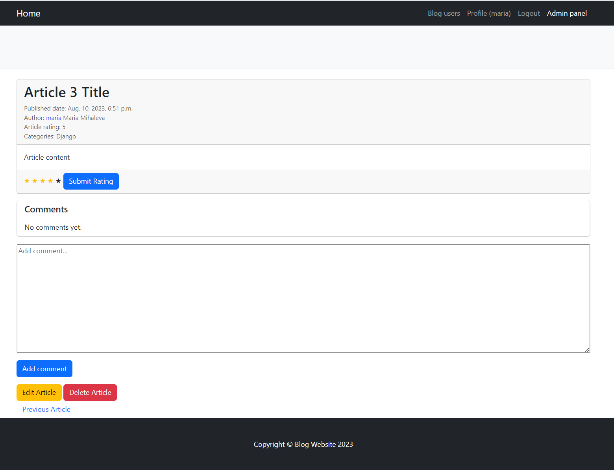

# Django Blog Platform

## Table of Contents

- [Description](#description)
- [Features](#features)
- [Installation](#installation)
- [Usage](#usage)
- [License](#license)
- [Authors](#authors)
- [Screenshots](#screenshots)
- [Project Status](#project-status)

## Description

The Django Blog Platform is a web application that allows users to create and manage their own blog posts. It provides
features such as user registration, login, article creation, article rating, and category filtering.
As part of my Python education, this is my first web application.

## Features

- User registration and login
- Create, edit, and delete blog articles
- Rate articles from 1 to 5 stars
- Filter articles by category
- User profile with profile picture upload

## Installation

1. Clone the repository to your local machine:

```
git clone https://github.com/your-username/django-blog-platform.git
```

2. Navigate to the project directory:

```
cd django-blog-platform
```

3. Create a virtual environment:

```
python -m venv venv
```

4. Activate the virtual environment:

- For Windows:

```
venv\Scripts\activate
```

- For macOS and Linux:

```
source venv/bin/activate
```

5. Install the required packages:

```
pip install -r requirements.txt
```

6. Run the development server:

```
python manage.py runserver
```

7. Access the application in your web browser at `http://localhost:8000/`.

## Usage

- Register a new user account or log in with an existing account.
- Create new blog articles by clicking on "New Article" in the navigation bar.
- Rate articles by clicking on the stars below each article.
- Filter articles by category using the category menu on the sidebar.

## License

This project is licensed under the MIT License - see the [LICENSE](LICENSE) file for details.

## Authors

- Maria Mihaleva (mabrasheva1@gmail.com)

## Screenshots





## Project Status

The project is actively maintained and under development.
